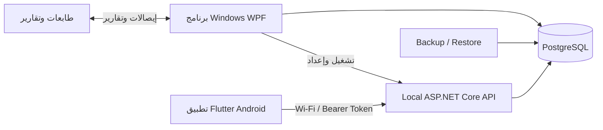

# فكرة النظام والربط بين الكمبيوتر والموبايل

## 1. الفكرة العامة

Hardware Paint Shop System هو نظام متكامل لإدارة محل حدايد وبويات. الهدف ليس مجرد برنامج كاشير، بل منصة تدير دورة العمل كاملة من شراء البضاعة وحتى بيعها ومتابعة المخزون والنقدية والديون والتقارير.

النظام يتكون من:

1. **برنامج كمبيوتر** لإدارة العمليات الكاملة والحساسة.
2. **قاعدة PostgreSQL** تحفظ كل بيانات المحل.
3. **API محلي** يعمل كوسيط آمن بين البيانات وتطبيق الموبايل.
4. **تطبيق Android** للوصول السريع والعمل أثناء الحركة.

## 2. لماذا كمبيوتر وموبايل معًا؟

برنامج الكمبيوتر مناسب للفواتير الكبيرة والتقارير والطباعة والإعدادات والنسخ الاحتياطي. الموبايل مناسب للجرد والبحث عن سعر أثناء الوقوف بجانب البضاعة، ومسح الباركود، ومتابعة العملاء والتنبيهات من أي مكان داخل المحل.

الفصل بينهما يحقق:

- واجهة كاملة على الكمبيوتر للعمليات المعقدة.
- سرعة ومرونة على الهاتف للعمليات اليومية الخفيفة.
- قاعدة بيانات مركزية تمنع وجود نسخ متعارضة من الأرقام.
- صلاحيات موحدة لنفس المستخدم على الجهازين.
- إمكانية العمل الجزئي Offline ثم المزامنة.

## 3. الشكل المعماري



قاعدة PostgreSQL هي المصدر النهائي للبيانات. الموبايل لا يتصل بها مباشرة، بل يتعامل مع API حتى يتم تطبيق الصلاحيات والتحقق من المدخلات ومنع تكرار العمليات.

## 4. توزيع المسؤوليات

| المسؤولية | الكمبيوتر | الموبايل |
| --- | --- | --- |
| إعداد قاعدة البيانات | أساسي | غير متاح |
| إدارة المستخدمين والصلاحيات | أساسي | يعرض المسموح فقط |
| المنتجات والأسعار | إدارة كاملة | بحث وعرض وإضافة محدودة |
| المشتريات | إدارة كاملة | مستقبلًا حسب الحاجة |
| البيع POS | إدارة كاملة وطباعة | ليس بديلًا للكاشير حاليًا |
| العملاء والتحصيل | كامل | عرض وتحصيل بالصلاحية |
| المخزون والجرد | كامل | بحث وتسوية وجرد ميداني |
| التقارير | كاملة | ملخص Dashboard وتنبيهات |
| النسخ الاحتياطي | كامل | غير متاح |
| الترخيص | تفعيل وإدارة | يعتمد على النظام المرخص |
| Offline | غير مطلوب عادة | كاش وPending Queue جزئي |

## 5. مثال دورة عمل كاملة

### استلام بضاعة

1. الموظف يسجل فاتورة شراء على الكمبيوتر.
2. النظام يضيف الكميات إلى المخزون.
3. يحدث تكلفة الصنف ورصيد المورد.
4. تظهر الكمية الجديدة على الموبايل بعد البحث أو المزامنة.

### بيع بضاعة

1. الكاشير يمسح الباركود في POS.
2. النظام يختار الوحدة والسعر المناسبين.
3. عند ترحيل الفاتورة يخصم المخزون ويحدث الخزينة أو مديونية العميل.
4. Dashboard والتنبيهات تتحدث من البيانات الجديدة.

### جرد من الهاتف

1. الموظف يقف بجانب الرف ويمسح الباركود.
2. التطبيق يعرض الرصيد المسجل.
3. المستخدم صاحب الصلاحية يسجل فرق الجرد والسبب.
4. عند توفر الشبكة يرسل التطبيق التسوية إلى API.
5. API يمنع المخزون السالب ويسجل الحركة وAudit Log.

## 6. المستخدمون والصلاحيات

نفس المستخدم يستطيع الدخول من الكمبيوتر والموبايل، لكن كل عملية تعتمد على Permission محددة. أمثلة:

```text
Api.Access
Product.View
Product.Create
Customer.View
Finance.CustomerCollection
Inventory.Adjust
Sync.Download
Sync.Upload
```

الأدوار تحدد مجموعة الصلاحيات، وOwner يحصل على صلاحيات الإدارة. API لا يثق في إخفاء الأزرار على الموبايل؛ كل طلب يفحص الصلاحية مرة أخرى على السيرفر.

## 7. المزامنة ومنع التكرار

عند انقطاع Wi-Fi، بعض العمليات تحفظ على الهاتف مع معرف فريد. عند عودة الاتصال:

1. يرفع الهاتف العمليات المعلقة.
2. API يبحث عن معرف العملية في سجل المزامنة.
3. لو نُفذت سابقًا لا يعيد تنفيذها.
4. الهاتف ينزل التغييرات التي حدثت منذ آخر مزامنة.
5. العمليات الناجحة تحذف من Pending Queue.

هذا مهم جدًا في العمليات المالية والمخزنية حتى لا يتكرر التحصيل أو التسوية بسبب ضغط زر المزامنة أكثر من مرة.

## 8. التشغيل داخل المحل

```text
الكمبيوتر الرئيسي
├── PostgreSQL على localhost:5432
├── برنامج Windows
└── API على 0.0.0.0:5000

الهاتف
└── يتصل بـ http://IP-الكمبيوتر:5000 عبر نفس Wi-Fi
```

المثال التالي يتغير حسب IP الحقيقي:

```text
http://192.168.1.7:5000
```

يجب السماح بالمنفذ 5000 على Windows Firewall للشبكات الخاصة فقط.

## 9. نموذج البيع المقترح للبرنامج

يمكن تقديم النظام كمنتج للمحلات في صورة:

- نسخة Windows مرخصة لكل جهاز رئيسي.
- تطبيق موبايل مرافق لعدد أجهزة متفق عليه.
- تركيب PostgreSQL وإعداد أول تشغيل.
- تدريب على المبيعات والمشتريات والجرد والنسخ الاحتياطي.
- عقد دعم وتحديثات اختيارية.
- تخصيص اسم المحل والطباعة والتقارير وفق المتطلبات المحلية.

الـEXE أو APK وحده لا يمثل منتجًا كاملًا؛ القيمة الحقيقية في Installer، الإعداد، Backup، الأمان، التدريب، والدعم.

## 10. الأمان والتشغيل الإنتاجي

- لا تحفظ أسرار قاعدة البيانات أو المفتاح الخاص داخل Git.
- غيّر حساب `admin` الافتراضي فورًا.
- استخدم أدوارًا محدودة للموظفين.
- احتفظ بنسخ احتياطية تلقائية واختبر الاستعادة.
- اجعل شبكة المحل Private ومحمية بكلمة قوية.
- لا تعرض PostgreSQL أو API مباشرة للإنترنت.
- استخدم VPN أو HTTPS Reverse Proxy للوصول الخارجي.
- راقب سجلات Audit وAPI والأخطاء.
- احتفظ بمفتاح الترخيص الخاص على جهاز البائع Offline.

## 11. الحالة الحالية

برنامج الكمبيوتر يغطي الوحدات الأساسية المطلوبة لاختبار قبول شامل. تطبيق الموبايل يعمل على Android، واجتاز `flutter analyze`، وتم بناؤه وتشغيله على هاتف حقيقي. معمارية الموبايل في مرحلة Refactor تدريجي: Core وAuth منفصلان، وسيتم نقل Dashboard وProducts وCustomers وAlerts وSync تباعًا.

قبل اعتباره إصدار بيع نهائيًا يجب إكمال اختبارات دورة العمل، الطباعة، Backup/Restore، التزامن على أكثر من هاتف، توقيع APK، وتجربة Installer على جهاز عميل نظيف.

## 12. الرؤية المستقبلية

- جرد كامل متعدد المستخدمين من الموبايل.
- إشعارات فورية لانخفاض المخزون والديون.
- مزامنة أكثر قوة مع معالجة التعارض والحذف.
- تقارير موبايل محسنة حسب الدور.
- تشغيل آمن من خارج المحل عبر VPN أو HTTPS.
- تحديث تلقائي للكمبيوتر والموبايل.
- دعم فروع متعددة ومستودعات متعددة عند الحاجة.
